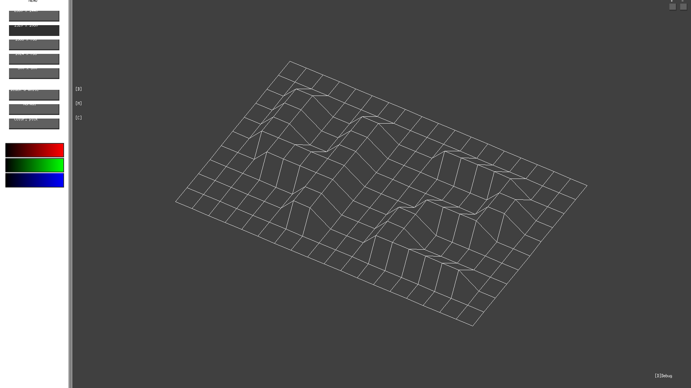
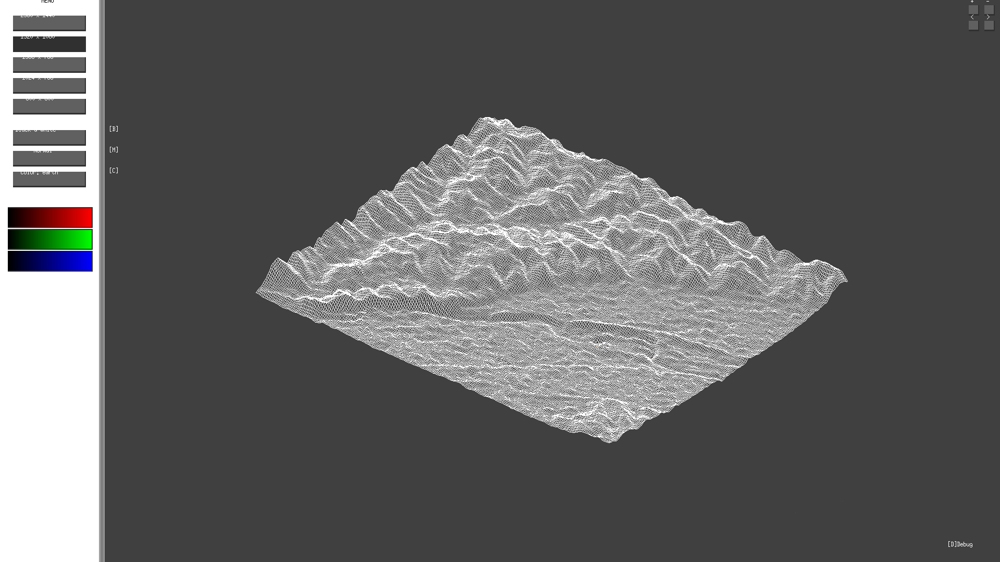
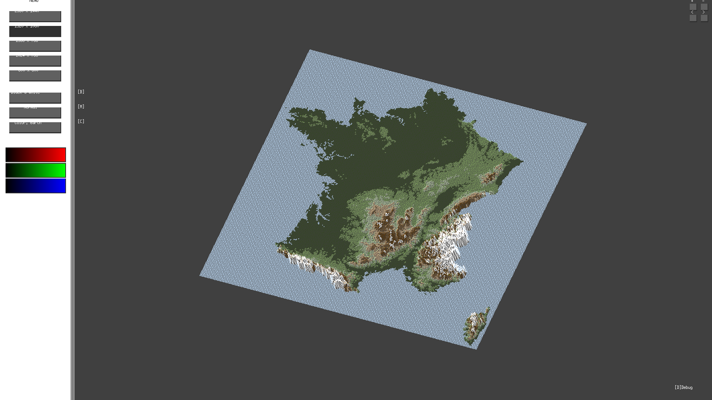
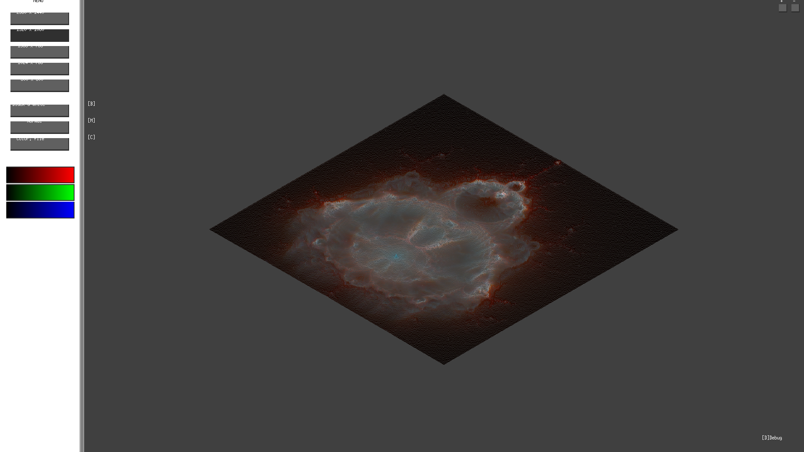

# Fdf









This is my version of Fdf project from 42. This software provides a wireframe representation of 3D terrains.

## User Guide

How to use Fdf

### Prerequisites

Only working on MacOSX atm. The following frameworks/libs are needed
```
OpenGL
Appkit
X11
```

### Installing

```
make
```

### Using Fdf

```
run ./fdf with one of any file given in test_maps/
```

## Features

* Map scaling and centering

* Window resolution

* 4 Displays: Iso, para, flat and perspective correct
```
⓵ ⓶ ⓷ ⓸
```

* Map movement
```
⇦ ⇨ ⇧ ⇩
```

* Altitude increasing and decreasing
```
⊞ ⊟
```

* Zoom
```
Mouse scroll
```

* Rotations
```
① ② for X rotation
④ ⑤ for Y rotation
⑥ ⑦ for Z rotation
(numpad)
OR
Mouse drag (X and Z rotations)
```

* Black & White mode
```
🄱
```

* Show middle of faces / triangles / nothing
```
🄼
```

* Color modes (pick up, file colors or earth-like)
```
🄲
```

* Scaling of earth-like colors
```
< >
```

* Debug utils
```
🄳
```

* Anti-Aliasing
```
🄰
```

* 3 Polygons carving (only in perspective correct mode)
```
🄿
```

* Fill object or not (only in perspective correct mode)
```
🄵
```

* Light (only in perspective correct mode)
```
🄻
```

* Trace edges (only in perspective correct mode)
```
🅃
```

* Edges color, black or white (only in perspective correct mode)
```
🄴
```

## Authors

Lucas Nicosia
